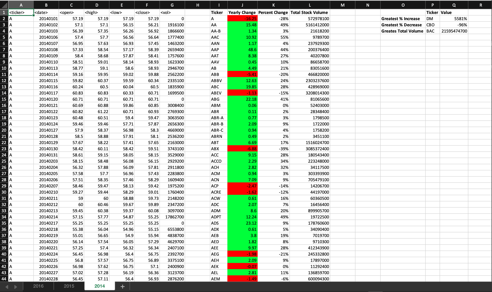
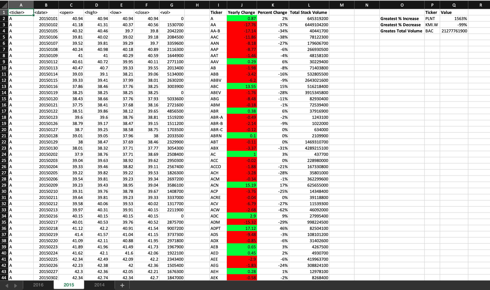
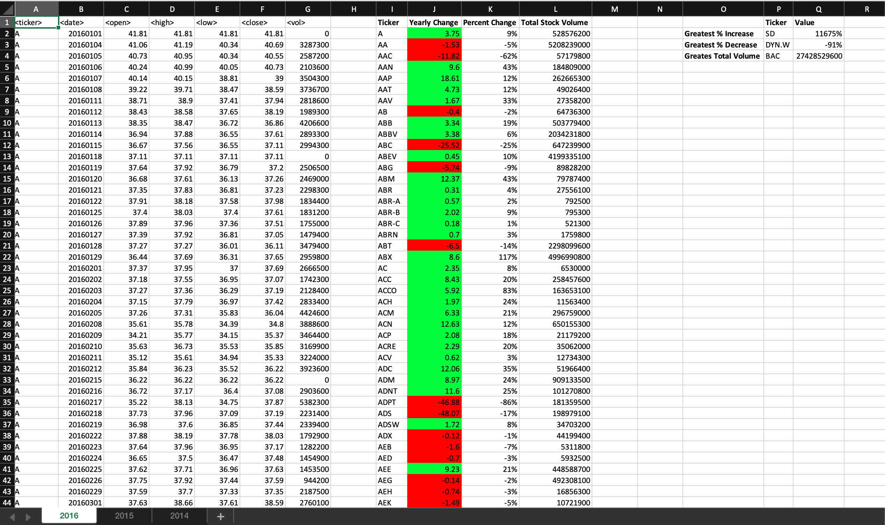

# VBA-challenge - The VBA of Wall Street

## Background

This project uses VBA scripting to analyze real stock market data.

## Solution

The scripts will loop through all the stocks for one year for each run and take the following information.

  * The ticker symbol.

  * Yearly change from opening price at the beginning of a given year to the closing price at the end of that year.

  * The percent change from opening price at the beginning of a given year to the closing price at the end of that year.
    * Using conditional formatting that will highlight positive change in green and negative change in red.

  * The total stock volume of the stock.

  * Return the stock with the "Greatest % increase", "Greatest % Decrease" and "Greatest total volume".

## Screenshots

### 2014 Stocks Analysis

### 2015 Stocks Analysis

### 2016 Stocks Analysis

- - -

### Copyright

© 2019